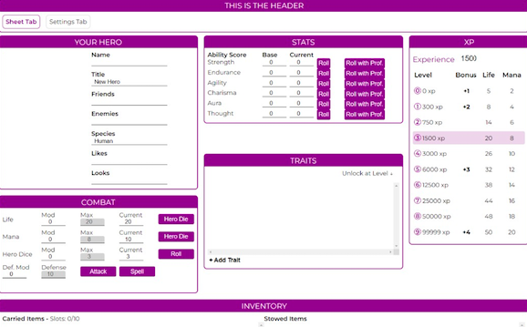

# Advanced Beacon Sheet

This is an advanced quick start sheet example. This sheet takes an advanced approach to building the Beacon sheet.

## Prerequisites

To set this sheet up properly, make sure that you have the following:

- Vue framework & Routing
- Multiple Data Stores
- Complex Roll Templates
- Rich Sheet Actions
- TypeScript
- Vite
- SCSS
- Ability to run Unit & End-to-End Tests


_**Figure 1**: Advanced sheet_

This sheet uses the same steps listed in the [Beginner sheet](/gettingstarted/quickstart.md). Immediately after implementing those three steps, you'll add the following step:

- **Run a CI check**: This will run several checks to ensure your code is as optimal as possible, including formatting, linting, type checking, unit tests, and end-to-end tests.

```bash
npm run ci-check
```

You can think of this command as a sanity check you can leverage when pushing a big release for your sheet!

## Useful Commands

The following set of commands can come in handy when working with this sheet:

- For Hot reloading and building CSS files, use the following command:

```bash
npm run watch-scss
```

- For linting, use the following command:

```bash
npm run lint
```

- For formatting with Prettier, use the following command:

```bash
npm run format
```

- For type checking with TypeScript, use the following command:

```bash
npm run type-check
```

- For running unit tests with Vitest, use the following command:

```bash
npm run test:unit
```

- To open up and develop local end-to-end tests with Cypress, use the following command:

```bash
npm run test:e2e:open:local
```

- For running local end-to-end tests with Cypress, use the following command:

```bash
npm run test:e2e:local
```

- To run CDN-hosted end-to-end tests with Cypress, use the following command:

```bash
npm run test:e2e
```